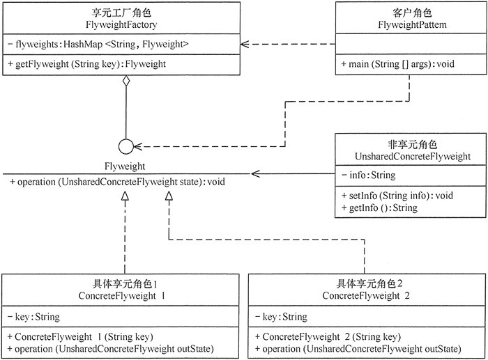

# 设计模式

## 绪论

> 它是解决特定问题的一系列套路，是前辈们的代码设计经验的总结，具有一定的普遍性，可以反复使用。其目的是为了提高代码的可重用性、代码的可读性和代码的可靠性。

> 设计模式的本质是面向对象设计原则的实际运用，是对类的封装性、继承性和多态性以及类的关联关系和组合关系的充分理解。正确使用设计模式具有以下优点。
>
> - 可以提高程序员的思维能力、编程能力和设计能力。
> - 使程序设计更加标准化、代码编制更加工程化，使软件开发效率大大提高，从而缩短软件的开发周期。
> - 使设计的代码可重用性高、可读性强、可靠性高、灵活性好、可维护性强。

设计模式根据==目的==来分：创建型模式、结构型模式和行为型模式

* 创建型模式：“怎样创建对象”（将对象的创建和使用分离）

  **单例、原型、工厂方法、抽象工厂、建造者**

* 结构型模式：“如何将类或对象按某种布局组成更大的结构”

  **代理、适配器、桥接、装饰、外观、享元、组合**

* 行为型模式：“类和对象之间怎样相互协作共同完成单个对象都无法单独完成的任务、怎样分配职责”

  **模板方法、策略、命令、职责链、状态、观察者、中介者、迭代器、访问者、备忘录、解释器**

设计模式根据==作用范围==来分：类模式、对象模式

|          | 创建型模式                   | 结构型模式                                         | 行为型模式                                                   |
| -------- | ---------------------------- | -------------------------------------------------- | ------------------------------------------------------------ |
| 类模式   | 工厂方法                     | (类）适配器                                        | 模板方法、解释器                                             |
| 对象模式 | 单例、原型、抽象工厂、建造者 | 代理 (对象）、适配器、桥接、装饰、外观、享元、组合 | 策略、命令、职责链、状态、观察者、中介者、迭代器、访问者、备忘录 |

## 简述

1. 单例（Singleton）模式：某个类只能生成一个实例，该类提供了一个全局访问点供外部获取该实例，其拓展是有限多例模式。
2. 原型（Prototype）模式：将一个对象作为原型，通过对其进行复制而克隆出多个和原型类似的新实例。
3. 工厂方法（Factory Method）模式：定义一个用于创建产品的接口，由子类决定生产什么产品。
4. 抽象工厂（AbstractFactory）模式：提供一个创建产品族的接口，其每个子类可以生产一系列相关的产品。
5. 建造者（Builder）模式：将一个复杂对象分解成多个相对简单的部分，然后根据不同需要分别创建它们，最后构建成该复杂对象。
6. 代理（Proxy）模式：为某对象提供一种代理以控制对该对象的访问。即客户端通过代理间接地访问该对象，从而限制、增强或修改该对象的一些特性。
7. 适配器（Adapter）模式：将一个类的接口转换成客户希望的另外一个接口，使得原本由于接口不兼容而不能一起工作的那些类能一起工作。
8. 桥接（Bridge）模式：将抽象与实现分离，使它们可以独立变化。它是用组合关系代替继承关系来实现，从而降低了抽象和实现这两个可变维度的耦合度。
9. 装饰（Decorator）模式：动态的给对象增加一些职责，即增加其额外的功能。
10. 外观（Facade）模式：为多个复杂的子系统提供一个一致的接口，使这些子系统更加容易被访问。
11. 享元（Flyweight）模式：运用共享技术来有效地支持大量细粒度对象的复用。
12. 组合（Composite）模式：将对象组合成树状层次结构，使用户对单个对象和组合对象具有一致的访问性。
13. 模板方法（TemplateMethod）模式：定义一个操作中的算法骨架，而将算法的一些步骤延迟到子类中，使得子类可以不改变该算法结构的情况下重定义该算法的某些特定步骤。
14. 策略（Strategy）模式：定义了一系列算法，并将每个算法封装起来，使它们可以相互替换，且算法的改变不会影响使用算法的客户。
15. 命令（Command）模式：将一个请求封装为一个对象，使发出请求的责任和执行请求的责任分割开。
16. 职责链（Chain of Responsibility）模式：把请求从链中的一个对象传到下一个对象，直到请求被响应为止。通过这种方式去除对象之间的耦合。
17. 状态（State）模式：允许一个对象在其内部状态发生改变时改变其行为能力。
18. 观察者（Observer）模式：多个对象间存在一对多关系，当一个对象发生改变时，把这种改变通知给其他多个对象，从而影响其他对象的行为。
19. 中介者（Mediator）模式：定义一个中介对象来简化原有对象之间的交互关系，降低系统中对象间的耦合度，使原有对象之间不必相互了解。
20. 迭代器（Iterator）模式：提供一种方法来顺序访问聚合对象中的一系列数据，而不暴露聚合对象的内部表示。
21. 访问者（Visitor）模式：在不改变集合元素的前提下，为一个集合中的每个元素提供多种访问方式，即每个元素有多个访问者对象访问。
22. 备忘录（Memento）模式：在不破坏封装性的前提下，获取并保存一个对象的内部状态，以便以后恢复它。
23. 解释器（Interpreter）模式：提供如何定义语言的文法，以及对语言句子的解释方法，即解释器。

## 设计原则

### **UML表示**

类：


```
[可见性]属性名:类型[=默认值]
例如：+display():void
公有（Public）、私有（Private）、受保护（Protected）和朋友（Friendly）4 种，在类图中分别用符号+、-、#、~表示。
```

接口：


类图：


### 开闭原则Open Closed Principle

当应用的需求改变时，在不修改软件实体的源代码或者二进制代码的前提下，可以扩展模块的功能，使其满足新的需求。

可以通过“抽象约束、封装变化”来实现开闭原则，即通过接口或者抽象类为软件实体定义一个相对稳定的抽象层，而将相同的可变因素封装在相同的具体实现类中。

因为抽象灵活性好，适应性广，只要抽象的合理，可以基本保持软件架构的稳定。而软件中易变的细节可以从抽象派生来的实现类来进行扩展，当软件需要发生变化时，只需要根据需求重新派生一个实现类来扩展就可以了。

### 里氏替换原则Liskov Substitution Principle

继承必须确保超类所拥有的性质在子类中仍然成立

>子类可以实现父类的抽象方法，但不能覆盖父类的非抽象方法
>
>子类中可以增加自己特有的方法
>
>当子类的方法重载父类的方法时，方法的前置条件（即方法的输入参数）要比父类的方法更宽松
>
>当子类的方法实现父类的方法时（重写/重载或实现抽象方法），方法的后置条件（即方法的的输出/返回值）要比父类的方法更严格或相等

通过重写父类的方法来完成新的功能写起来虽然简单，但是整个继承体系的可复用性会比较差，特别是运用多态比较频繁时，程序运行出错的概率会非常大。

**如果程序违背了里氏替换原则**，则继承类的对象在基类出现的地方会出现运行错误。这时其修正方法是：取消原来的继承关系，**重新设计它们之间的关系**。

### 依赖倒置原则Dependence Inversion Principle

要面向接口编程，不要面向实现编程。

> 依赖倒置原则可以降低类间的耦合性。
>
> 依赖倒置原则可以提高系统的稳定性。
>
> 依赖倒置原则可以减少并行开发引起的风险。
>
> 依赖倒置原则可以提高代码的可读性和可维护性。

实现方法：

> 每个类尽量提供接口或抽象类，或者两者都具备。
>
> 变量的声明类型尽量是接口或者是抽象类。
>
> 任何类都不应该从具体类派生。
>
> 使用继承时尽量遵循里氏替换原则。

### 单一职责原则Single Responsibility Principle

> 降低类的复杂度。一个类只负责一项职责，其逻辑肯定要比负责多项职责简单得多。
>
> 提高类的可读性。复杂性降低，自然其可读性会提高。
>
> 提高系统的可维护性。可读性提高，那自然更容易维护了。
>
> 变更引起的风险降低。变更是必然的，如果单一职责原则遵守得好，当修改一个功能时，可以显著降低对其他功能的影响。

单一职责原则是最简单但又最难运用的原则，需要设计人员发现类的不同职责并将其分离，再封装到不同的类或模块中。而发现类的多重职责需要设计人员具有较强的分析设计能力和相关重构经验。

单一职责同样也适用于方法。一个方法应该尽可能做好一件事情。如果一个方法处理的事情太多，其颗粒度会变得很粗，不利于重用。

### 接口隔离原则Interface Segregation Principle

要求程序员尽量将臃肿庞大的接口拆分成更小的和更具体的接口，让接口中只包含客户感兴趣的方法。

要**为各个类建立它们需要的专用接口**，而不要试图去建立一个很庞大的接口供所有依赖它的类去调用。

接口隔离原则是为了约束接口、降低类对接口的依赖性，遵循接口隔离原则有以下 5 个优点。

> 将臃肿庞大的接口分解为多个粒度小的接口，可以预防外来变更的扩散，提高系统的灵活性和可维护性。
>
> 接口隔离提高了系统的内聚性，减少了对外交互，降低了系统的耦合性。
>
> 如果接口的粒度大小定义合理，能够保证系统的稳定性；但是，如果定义过小，则会造成接口数量过多，使设计复杂化；如果定义太大，灵活性降低，无法提供定制服务，给整体项目带来无法预料的风险。
>
> 使用多个专门的接口还能够体现对象的层次，因为可以通过接口的继承，实现对总接口的定义。
>
> 能减少项目工程中的代码冗余。过大的大接口里面通常放置许多不用的方法，当实现这个接口的时候，被迫设计冗余的代码。

例：学生成绩管理程序一般包含插入成绩、删除成绩、修改成绩、计算总分、计算均分、打印成绩信息、査询成绩信息等功能，如果将这些功能全部放到一个接口中显然不太合理，正确的做法是将它们分别放在输入模块、统计模块和打印模块等 3 个模块中。

### 迪米特法则Law of Demeter(Least Knowledge Principle，LKP)

> 迪米特法则要求限制软件实体之间通信的宽度和深度，正确使用迪米特法则将有以下两个优点。
>
> 1. 降低了类之间的耦合度，提高了模块的相对独立性。
> 2. 由于亲合度降低，从而提高了类的可复用率和系统的扩展性。
>
>
> 但是，过度使用迪米特法则会使系统产生大量的中介类，从而增加系统的复杂性，使模块之间的通信效率降低。所以，在釆用迪米特法则时需要反复权衡，确保高内聚和低耦合的同时，保证系统的结构清晰。

在运用迪米特法则时要注意以下 6 点。

1. 在类的划分上，应该创建弱耦合的类。类与类之间的耦合越弱，就越有利于实现可复用的目标。
2. 在类的结构设计上，尽量降低类成员的访问权限。
3. 在类的设计上，优先考虑将一个类设置成不变类。
4. 在对其他类的引用上，将引用其他对象的次数降到最低。
5. 不暴露类的属性成员，而应该提供相应的访问器（set 和 get 方法）。
6. 谨慎使用序列化（Serializable）功能。

### 合成复用原则Composite Reuse Principle

> 通常类的复用分为继承复用和合成复用两种，继承复用虽然有简单和易实现的优点，但它也存在以下缺点。
>
> 1. 继承复用破坏了类的封装性。因为继承会将父类的实现细节暴露给子类，父类对子类是透明的，所以这种复用又称为“白箱”复用。
> 2. 子类与父类的耦合度高。父类的实现的任何改变都会导致子类的实现发生变化，这不利于类的扩展与维护。
> 3. 它限制了复用的灵活性。从父类继承而来的实现是静态的，在编译时已经定义，所以在运行时不可能发生变化。

采用组合或聚合复用时，可以将已有对象纳入新对象中，使之成为新对象的一部分，新对象可以调用已有对象的功能，它有以下优点。

1. 它维持了类的封装性。因为成分对象的内部细节是新对象看不见的，所以这种复用又称为“黑箱”复用。
2. 新旧类之间的耦合度低。这种复用所需的依赖较少，新对象存取成分对象的唯一方法是通过成分对象的接口。
3. 复用的灵活性高。这种复用可以在运行时动态进行，新对象可以动态地引用与成分对象类型相同的对象。


变为：


## 创建型模式

### 1 单例

1. 单例类只有一个实例对象；
2. 该单例对象必须由单例类自行创建；
3. 单例类对外提供一个访问该单例的全局访问点。

#### 优缺点

单例模式的优点：

- 单例模式可以保证内存里只有一个实例，减少了内存的开销。
- 可以避免对资源的多重占用。
- 单例模式设置全局访问点，可以优化和共享资源的访问。


单例模式的缺点：

- 单例模式一般没有接口，扩展困难。如果要扩展，则除了修改原来的代码，没有第二种途径，违背开闭原则。
- 在并发测试中，单例模式不利于代码调试。在调试过程中，如果单例中的代码没有执行完，也不能模拟生成一个新的对象。
- 单例模式的功能代码通常写在一个类中，如果功能设计不合理，则很容易违背单一职责原则。

#### 应用场景

对于 [Java](http://c.biancheng.net/java/) 来说，单例模式可以保证在一个 JVM 中只存在单一实例。单例模式的应用场景主要有以下几个方面。

- 需要**频繁创建**的一些类，使用单例可以降低系统的内存压力，减少 GC。
- 某类只要求生成**一个对象**的时候，如一个班中的班长、每个人的身份证号等。
- 某些类创建实例时**占用资源较多**，或实例化耗时较长，且经常使用。
- 某类需要**频繁实例化**，而创建的对象又频繁被销毁的时候，如多线程的线程池、网络连接池等。
- **频繁访问数据库或文件的对象**。
- 对于一些**控制硬件级别的操作**，或者从系统上来讲应当是单一控制逻辑的操作，如果有多个实例，则系统会完全乱套。
- 当对象需要被共享的场合。由于单例模式只允许创建一个对象，共享该对象可以节省内存，并加快对象访问速度。如 Web 中的**配置对象**、数据库的**连接池**等。

#### 创建方式

通常，普通类的构造函数是公有的，外部类可以通过“new 构造函数()”来生成多个实例。但是，如果将类的构造函数设为私有的，外部类就无法调用该构造函数，也就无法生成多个实例。这时该类自身必须定义一个静态私有实例，并向外提供一个静态的公有函数用于创建或获取该静态私有实例。

```java
//懒汉式
class LazySingleton {
    private LazySingleton() {
    }

    private static volatile LazySingleton instance = null;

    //懒汉式要保证线程安全，因此每次调用要同步，影响性能
    public static synchronized LazySingleton getInstance() {
        if (instance == null) instance = new LazySingleton();
        return instance;
    }
}

//饿汉式
class HungerSingleton {
    private HungerSingleton() {
    }
    private static final HungerSingleton instance=new HungerSingleton();
    public static HungerSingleton getInstance(){
        return instance;
    }
}
```

### 2 原型

用一个已经创建的实例作为原型，通过复制该原型对象来创建一个和原型相同或相似的新对象。在这里，原型实例指定了要创建的对象的种类。用这种方式创建对象非常高效，根本无须知道对象创建的细节。

#### 优缺点

原型模式的优点：

- [Java](http://c.biancheng.net/java/) 自带的原型模式基于内存二进制流的复制，在性能上比直接 new 一个对象更加优良。
- 可以使用深克隆方式保存对象的状态，使用原型模式将对象复制一份，并将其状态保存起来，简化了创建对象的过程，以便在需要的时候使用（例如恢复到历史某一状态），可辅助实现撤销操作。

原型模式的缺点：

- 需要为每一个类都配置一个 clone 方法
- clone 方法位于类的内部，当对已有类进行改造的时候，需要修改代码，违背了开闭原则。
- 当实现深克隆时，需要编写较为复杂的代码，而且当对象之间存在多重嵌套引用时，为了实现深克隆，每一层对象对应的类都必须支持深克隆，实现起来会比较麻烦。因此，深克隆、浅克隆需要运用得当。

> 浅克隆：创建一个新对象，新对象的属性和原来对象完全相同，对于非基本类型属性，仍指向原有属性所指向的对象的内存地址。
>
> 深克隆：创建一个新对象，属性中引用的其他对象也会被克隆，不再指向原有对象地址。

#### 实现

```java
public class ProtoTypeCitation {
    public static void main(String[] args) throws CloneNotSupportedException {
        citation obj1 = new citation("张三", "同学：在2016学年第一学期中表现优秀，被评为三好学生。", "韶关学院");
        obj1.display();
        citation obj2 = (citation) obj1.clone();
        obj2.setName("李四");
        obj2.display();
    }
}

//奖状类 实现Cloneable接口
class citation implements Cloneable {
    String name;
    String info;
    String college;

    citation(String name, String info, String college) {
        this.name = name;
        this.info = info;
        this.college = college;
        System.out.println("奖状创建成功！");
    }

    void setName(String name) {
        this.name = name;
    }

    String getName() {
        return (this.name);
    }

    void display() {
        System.out.println(name + info + college);
    }

    //只是浅拷贝
    public Object clone() throws CloneNotSupportedException {
        System.out.println("奖状拷贝成功！");
        return (citation) super.clone();
    }
}
```

#### 适用场景

原型模式通常适用于以下场景。

- 对象之间相同或相似，即只是个别的几个属性不同的时候。
- 创建对象成本较大，例如初始化时间长，占用CPU太多，或者占用网络资源太多等，需要优化资源。
- 创建一个对象需要繁琐的数据准备或访问权限等，需要提高性能或者提高安全性。
- 系统中大量使用该类对象，且各个调用者都需要给它的属性重新赋值。


在 [Spring](http://c.biancheng.net/spring/) 中，原型模式应用的非常广泛，例如 scope='prototype'、JSON.parseObject() 等都是原型模式的具体应用。

### 工厂模式

#### 简单工厂(不在23种设计模式中)

我们把被创建的对象称为“产品”，把创建产品的对象称为“工厂”。如果**要创建的产品不多**，只要一个工厂类就可以完成，这种模式叫“简单工厂模式”。

在简单工厂模式中创建实例的方法通常为静态（static）方法，因此简单工厂模式（Simple Factory Pattern）又叫作静态工厂方法模式（Static Factory Method Pattern）。

##### 优缺点

优点：

1. 工厂类包含必要的逻辑判断，可以决定在什么时候创建哪一个产品的实例。客户端可以免除直接创建产品对象的职责，很方便的创建出相应的产品。工厂和产品的职责区分明确。
2. 客户端无需知道所创建具体产品的类名，只需知道参数即可。
3. 也可以引入配置文件，在不修改客户端代码的情况下更换和添加新的具体产品类。

缺点：

1. 简单工厂模式的工厂类单一，负责所有产品的创建，职责过重，一旦异常，整个系统将受影响。且工厂类代码会非常臃肿，违背高聚合原则。
2. 使用简单工厂模式会增加系统中类的个数（引入新的工厂类），增加系统的复杂度和理解难度
3. 系统扩展困难，一旦增加新产品不得不修改工厂逻辑，在产品类型较多时，可能造成逻辑过于复杂
4. 简单工厂模式使用了 static 工厂方法，造成工厂角色无法形成基于继承的等级结构。


#### 3 工厂方法

“工厂方法模式”是对简单工厂模式的进一步抽象化，其好处是可以使系统在不修改原来代码的情况下引进新的产品，即满足开闭原则。

##### 优缺点

优点：

- 用户只需要知道具体工厂的名称就可得到所要的产品，无须知道产品的具体创建过程。
- 灵活性增强，对于新产品的创建，只需多写一个相应的工厂类。
- 典型的解耦框架。高层模块只需要知道产品的抽象类，无须关心其他实现类，满足迪米特法则、依赖倒置原则和里氏替换原则。

缺点：

- 类的个数容易过多，增加复杂度
- 增加了系统的抽象性和理解难度
- 抽象产品只能生产一种产品，此弊端可使用[抽象工厂模式](http://c.biancheng.net/view/1351.html)解决。


#### 4 抽象工厂

抽象工厂（AbstractFactory）模式的定义：是一种为访问类提供一个创建一组相关或相互依赖对象的接口，且访问类无须指定所要产品的具体类就能得到同族的不同等级的产品的模式结构。

抽象工厂模式是工厂方法模式的升级版本，工厂方法模式只生产一个等级的产品，而抽象工厂模式可生产多个等级的产品。

使用抽象工厂模式一般要满足以下条件。

- 系统中有多个产品族，每个具体工厂创建同一族但属于不同等级结构的产品。
- 系统一次只可能消费其中某一族产品，即同族的产品一起使用。


抽象工厂模式除了具有工厂方法模式的优点外，其他主要优点如下。

- 可以在类的内部对产品族中相关联的多等级产品共同管理，而不必专门引入多个新的类来进行管理。
- 当需要产品族时，抽象工厂可以保证客户端始终只使用同一个产品的产品组。
- 抽象工厂增强了程序的可扩展性，当增加一个新的产品族时，不需要修改原代码，满足开闭原则。


其缺点是：当产品族中需要增加一个新的产品时，所有的工厂类都需要进行修改。增加了系统的抽象性和理解难度。

##### 应用场景

抽象工厂模式最早的应用是用于创建属于不同操作系统的视窗构件。如 [Java](http://c.biancheng.net/java/) 的 AWT 中的 Button 和 Text 等构件在 Windows 和 UNIX 中的本地实现是不同的。

抽象工厂模式通常适用于以下场景：

1. 当需要创建的对象是一系列相互关联或相互依赖的产品族时，如电器工厂中的电视机、洗衣机、空调等。
2. 系统中有多个产品族，但每次只使用其中的某一族产品。如有人只喜欢穿某一个品牌的衣服和鞋。
3. 系统中提供了产品的类库，且所有产品的接口相同，客户端不依赖产品实例的创建细节和内部结构。

当系统中只存在一个等级结构的产品时，抽象工厂模式将退化到工厂方法模式。


### 5 建造者

将一个复杂对象的构造与它的表示分离，使同样的构建过程可以创建不同的表示

#### 优缺点

该模式的主要优点如下：

1. 封装性好，构建和表示分离。
2. 扩展性好，各个具体的建造者相互独立，有利于系统的解耦。
3. 客户端不必知道产品内部组成的细节，建造者可以对创建过程逐步细化，而不对其它模块产生任何影响，便于控制细节风险。


其缺点如下：

1. 产品的组成部分必须相同，这限制了其使用范围。
2. 如果产品的内部变化复杂，如果产品内部发生变化，则建造者也要同步修改，后期维护成本较大。

建造者（Builder）模式和工厂模式的关注点不同：建造者模式注重零部件的组装过程，而工厂方法模式更注重零部件的创建过程，但两者可以结合使用。

建造者（Builder）模式由**产品**、**抽象建造者**、**具体建造者**、**指挥者**等 4 个要素构成

建造者模式唯一区别于工厂模式的是针对复杂对象的创建。也就是说，如果创建简单对象，通常都是使用工厂模式进行创建，而如果创建复杂对象，就可以考虑使用建造者模式。


## 结构型模式

分为类结构型模式和对象结构型模式，前者采用继承机制来组织接口和类，后者釆用组合或聚合来组合对象。

由于组合关系或聚合关系比继承关系耦合度低，满足“合成复用原则”，所以对象结构型模式比类结构型模式具有更大的灵活性。

### 6 代理


根据代理的创建时期，代理模式分为静态代理和动态代理。

- 静态：由程序员创建代理类或特定工具自动生成源代码再对其编译，在程序运行前代理类的 .class 文件就已经存在了。
- 动态：在程序运行时，运用反射机制动态创建而成

```java
package proxy;

public class ProxyTest {
    public static void main(String[] args) {
        Proxy proxy = new Proxy();
        proxy.Request();
    }
}

//抽象主题
interface Subject {
    void Request();
}

//真实主题
class RealSubject implements Subject {
    public void Request() {
        System.out.println("访问真实主题方法...");
    }
}

//代理
class Proxy implements Subject {
    private RealSubject realSubject;

    public void Request() {
        if (realSubject == null) {
            realSubject = new RealSubject();
        }
        preRequest();
        realSubject.Request();
        postRequest();
    }

    public void preRequest() {
        System.out.println("访问真实主题之前的预处理。");
    }

    public void postRequest() {
        System.out.println("访问真实主题之后的后续处理。");
    }
}
```

当无法或不想直接引用某个对象或访问某个对象存在困难时，可以通过代理对象来间接访问。使用代理模式主要有两个目的：一是保护目标对象，二是增强目标对象。

#### 应用场景

- 远程代理，这种方式通常是为了隐藏目标对象存在于不同地址空间的事实，方便客户端访问。例如，用户申请某些网盘空间时，会在用户的文件系统中建立一个虚拟的硬盘，用户访问虚拟硬盘时实际访问的是网盘空间。
- 虚拟代理，这种方式通常用于要创建的目标对象开销很大时。例如，下载一幅很大的图像需要很长时间，因某种计算比较复杂而短时间无法完成，这时可以先用小比例的虚拟代理替换真实的对象，消除用户对服务器慢的感觉。
- 安全代理，这种方式通常用于控制不同种类客户对真实对象的访问权限。
- 智能指引，主要用于调用目标对象时，代理附加一些额外的处理功能。例如，增加计算真实对象的引用次数的功能，这样当该对象没有被引用时，就可以自动释放它。
- 延迟加载，指为了提高系统的性能，延迟对目标的加载。例如，[Hibernate](http://c.biancheng.net/hibernate/) 中就存在属性的延迟加载和关联表的延时加载。

**动态代理模式**


### 7 适配器

将一个类的接口转换成客户希望的另外一个接口，使得原本由于接口不兼容而不能一起工作的那些类能一起工作。适配器模式分为类结构型模式和**对象结构型模式**两种，前者类之间的耦合度比后者高，且要求程序员了解现有组件库中的相关组件的内部结构，所以应用相对较少些。

#### 优缺点

该模式的主要优点如下：

- 客户端通过适配器可以**透明地调用目标接口**。
- 复用了现存的类，程序员**不需要修改原有代码**而重用现有的适配者类。
- **将目标类和适配者类解耦**，解决了目标类和适配者类接口不一致的问题。
- 在很多业务场景中符合**开闭原则**。


其缺点是：

- 适配器编写过程需要结合业务场景全面考虑，可能会增加系统的复杂性。
- 增加代码阅读难度，降低代码可读性，过多使用适配器会使系统代码变得凌乱。

#### 类结构型模式


#### 对象结构型模式


#### 双向适配器模式

既可以把适配者接口转换成目标接口，也可以把目标接口转换成适配者接口


```java
package adapter;
//目标接口
interface TwoWayTarget
{
    public void request();
}
//适配者接口
interface TwoWayAdaptee
{
    public void specificRequest();
}
//目标实现
class TargetRealize implements TwoWayTarget
{
    public void request()
    {       
        System.out.println("目标代码被调用！");
    }
}
//适配者实现
class AdapteeRealize implements TwoWayAdaptee
{
    public void specificRequest()
    {       
        System.out.println("适配者代码被调用！");
    }
}
//双向适配器
class TwoWayAdapter  implements TwoWayTarget,TwoWayAdaptee
{
    private TwoWayTarget target;
    private TwoWayAdaptee adaptee;
    public TwoWayAdapter(TwoWayTarget target)
    {
        this.target=target;
    }
    public TwoWayAdapter(TwoWayAdaptee adaptee)
    {
        this.adaptee=adaptee;
    }
    public void request()
    {
        adaptee.specificRequest();
    }
    public void specificRequest()
    {       
        target.request();
    }
}
//客户端代码
public class TwoWayAdapterTest
{
    public static void main(String[] args)
    {
        System.out.println("目标通过双向适配器访问适配者：");
        TwoWayAdaptee adaptee=new AdapteeRealize();
        //这里target里面的request调用的其实是adaptee里面的specificRequest
        TwoWayTarget target=new TwoWayAdapter(adaptee);
        target.request();
        System.out.println("-------------------");
        System.out.println("适配者通过双向适配器访问目标：");
        target=new TargetRealize();
        adaptee=new TwoWayAdapter(target);
        adaptee.specificRequest();
    }
}

//运行结果
目标通过双向适配器访问适配者：
适配者代码被调用！
-------------------
适配者通过双向适配器访问目标：
目标代码被调用！
```

### 8 桥接

**将抽象与实现分离，使它们可以独立变化。**它是用组合关系代替继承关系来实现，从而降低了抽象和实现这两个可变维度的耦合度。

#### 优缺点

桥接（Bridge）模式的优点是：

- 抽象与实现分离，扩展能力强
- 符合开闭原则
- 符合合成复用原则
- 其实现细节对客户透明

缺点是：由于聚合关系建立在抽象层，要求开发者针对抽象化进行设计与编程，能正确地识别出系统中两个独立变化的维度，这增加了系统的理解与设计难度。


#### 应用场景

当一个类内部具备两种或多种变化维度时，使用桥接模式可以解耦这些变化的维度，使高层代码架构稳定。

桥接模式通常适用于以下场景。

1. 当一个类存在两个**独立变化的维度**，且这两个维度**都需要进行扩展**时。
2. 当一个系统**不希望使用继承**或因为多层次继承导致系统类的个数急剧增加时。
3. 当一个系统需要在构件的抽象化角色和具体化角色之间增加更多的灵活性时。

桥接模式的一个常见使用场景就是替换继承。我们知道，继承拥有很多优点，比如，抽象、封装、多态等，父类封装共性，子类实现特性。继承可以很好的实现代码复用（封装）的功能，但这也是继承的一大缺点。

#### 扩展

在软件开发中，有时桥接（Bridge）模式可与适配器模式联合使用。当桥接（Bridge）模式的实现化角色的接口与现有类的接口不一致时，可以在二者中间定义一个适配器将二者连接起来


### 9 装饰


```java
package decorator;

public class DecoratorPattern {
    public static void main(String[] args) {
        Component p = new ConcreteComponent();
        p.operation();
        System.out.println("---------------------------------");
        Component d = new ConcreteDecorator(p);
        d.operation();
    }
}

//抽象构件角色
interface Component {
    public void operation();
}

//具体构件角色
class ConcreteComponent implements Component {
    public ConcreteComponent() {
        System.out.println("创建具体构件角色");
    }

    public void operation() {
        System.out.println("调用具体构件角色的方法operation()");
    }
}

//抽象装饰角色
class Decorator implements Component {
    private Component component;

    public Decorator(Component component) {
        this.component = component;
    }

    //为原来的方法装饰其他的代码逻辑
    public void operation() {
        component.operation();
    }
}

//具体装饰角色
class ConcreteDecorator extends Decorator {
    public ConcreteDecorator(Component component) {
        super(component);
    }

    public void operation() {
        super.operation();
        addedFunction();
    }

    public void addedFunction() {
        System.out.println("为具体构件角色增加额外的功能addedFunction()");
    }
}
```

#### 应用场景

装饰模式通常在以下几种情况使用：

- 当需要给一个现有类**添加附加职责**，而又**不能采用生成子类的方法进行扩充**时。例如，该类被隐藏或者该类是终极类或者采用继承方式会产生大量的子类。
- 当需要通过对现有的一组基本功能进行排列组合而产生非常多的功能时，采用继承关系很难实现，而采用装饰模式却很好实现。
- 当对象的功能要求可以**动态地添加**，也可以再**动态地撤销**时。


装饰模式在 [Java](http://c.biancheng.net/java/) 语言中的最著名的应用莫过于 Java I/O 标准库的设计了。例如，InputStream 的子类 FilterInputStream，OutputStream 的子类 FilterOutputStream，Reader 的子类 BufferedReader 以及 FilterReader，还有 Writer 的子类 BufferedWriter、FilterWriter 以及 PrintWriter 等，它们都是抽象装饰类。

#### 扩展

装饰模式所包含的 4 个角色不是任何时候都要存在的，在有些应用环境下模式是可以简化的


以及：


### 10 外观

当一个系统的功能越来越强，子系统会越来越多，客户对系统的访问也变得越来越复杂。这时如果系统内部发生改变，客户端也要跟着改变，这违背了“开闭原则”，也违背了“迪米特法则”，所以有必要为多个子系统提供一个统一的接口，从而降低系统的耦合度，这就是外观模式的目标。


#### 优缺点

外观（Facade）模式是“迪米特法则”的典型应用，它有以下主要优点。

1. 降低了子系统与客户端之间的耦合度，使得子系统的变化不会影响调用它的客户类。
2. 对客户屏蔽了子系统组件，减少了客户处理的对象数目，并使得子系统使用起来更加容易。
3. 降低了大型软件系统中的编译依赖性，简化了系统在不同平台之间的移植过程，因为编译一个子系统不会影响其他的子系统，也不会影响外观对象。

外观（Facade）模式的主要缺点如下。

1. 不能很好地限制客户使用子系统类，很容易带来未知风险。
2. 增加新的子系统可能需要修改外观类或客户端的源代码，违背了“开闭原则”。

#### 应用场景

1. 对分层结构系统构建时，使用外观模式定义子系统中每层的入口点可以简化子系统之间的依赖关系。
2. 当一个复杂系统的子系统很多时，外观模式可以为系统设计一个简单的接口供外界访问。
3. 当客户端与多个子系统之间存在很大的联系时，引入外观模式可将它们分离，从而提高子系统的独立性和可移植性。

#### 扩展

在外观模式中，当增加或移除子系统时需要修改外观类，这违背了“开闭原则”。如果引入抽象外观类，则在一定程度上解决了该问题


### 11 享元

在面向对象程序设计过程中，有时会面临要创建大量相同或相似对象实例的问题。创建那么多的对象将会耗费很多的系统资源，它是系统性能提高的一个瓶颈。

享元（Flyweight）模式的定义：运用共享技术来有效地支持大量细粒度对象的复用。它通过共享已经存在的对象来大幅度减少需要创建的对象数量、避免大量相似类的开销，从而提高系统资源的利用率。

#### 优缺点

享元模式的主要优点是：相同对象只要保存一份，这降低了系统中对象的数量，从而降低了系统中细粒度对象给内存带来的压力。

其主要缺点是：

1. 为了使对象可以共享，需要将一些不能共享的状态外部化，这将增加程序的复杂性。
2. 读取享元模式的外部状态会使得运行时间稍微变长。

享元模式的本质是缓存共享对象，降低内存消耗。

#### 结构

抽象享元角色（Flyweight）：是所有的具体享元类的基类，为具体享元规范需要实现的公共接口，非享元的外部状态以参数的形式通过方法传入。

具体享元（Concrete Flyweight）角色：实现抽象享元角色中所规定的接口。

非享元（Unsharable Flyweight)角色：是不可以共享的外部状态，它以**参数的形式**注入具体享元的相关方法中。

享元工厂（Flyweight Factory）角色：负责创建和管理享元角色。当客户对象请求一个享元对象时，享元工厂检査系统中是否存在符合要求的享元对象，如果存在则提供给客户；如果不存在的话，则创建一个新的享元对象。



当系统中多处需要同一组信息时，可以把这些信息封装到一个对象中，然后对该对象进行缓存，这样，一个对象就可以提供给多出需要使用的地方，避免大量同一对象的多次创建，降低大量内存空间的消耗。

享元模式其实是[工厂方法模式](http://c.biancheng.net/view/1348.html)的一个改进机制，享元模式同样要求创建一个或一组对象，并且就是通过工厂方法模式生成对象的，只不过享元模式为工厂方法模式增加了缓存这一功能。

举例：下围棋，棋子只有两类，坐标为可变量（非共享）

#### 扩展


复合享元：


### 12 组合

有时又叫作整体-部分（Part-Whole）模式，它是一种将对象组合成树状的层次结构的模式，用来表示“整体-部分”的关系，使用户对单个对象和组合对象具有一致的访问性

#### 优缺点

组合模式的主要优点有：

1. 组合模式使得客户端代码可以一致地处理单个对象和组合对象，无须关心自己处理的是单个对象，还是组合对象，这简化了客户端代码；
2. 更容易在组合体内加入新的对象，客户端不会因为加入了新的对象而更改源代码，满足“开闭原则”；

其主要缺点是：

1. 设计较复杂，客户端需要花更多时间理清类之间的层次关系；
2. 不容易限制容器中的构件；
3. 不容易用继承的方法来增加构件的新功能；

组合模式分为**透明式**的组合模式和**安全式**的组合模式。

透明式：


树叶构件本来没有 Add()、Remove() 及 GetChild() 方法，却要实现它们（空实现或抛异常），这样会带来一些安全性问题。

安全式：


由于叶子和分支有不同的接口，客户端在调用时要知道树叶对象和树枝对象的存在，所以失去了透明性。

#### 扩展


## 行为型模式

用于描述程序在运行时复杂的流程控制，即描述多个类或对象之间怎样相互协作共同完成单个对象都无法单独完成的任务，它涉及算法与对象间职责的分配。

行为型模式分为类行为模式和对象行为模式，前者采用继承机制来在类间分派行为，后者采用组合或聚合在对象间分配行为。由于组合关系或聚合关系比继承关系耦合度低，满足“合成复用原则”，所以对象行为模式比类行为模式具有更大的灵活性。

### 13 模板方法

定义一个操作中的算法骨架，而将算法的一些步骤延迟到子类中，使得子类可以不改变该算法结构的情况下重定义该算法的某些特定步骤。它是一种类行为型模式。

#### 优缺点

该模式的主要优点如下。

1. 它封装了不变部分，扩展可变部分。它把认为是不变部分的算法封装到父类中实现，而把可变部分算法由子类继承实现，便于子类继续扩展。
2. 它在父类中提取了公共的部分代码，便于代码复用。
3. 部分方法是由子类实现的，因此子类可以通过扩展方式增加相应的功能，符合开闭原则。

该模式的主要缺点如下。

1. 对每个不同的实现都需要定义一个子类，这会导致类的个数增加，系统更加庞大，设计也更加抽象，间接地增加了系统实现的复杂度。
2. 父类中的抽象方法由子类实现，子类执行的结果会影响父类的结果，这导致一种反向的控制结构，它提高了代码阅读的难度。
3. 由于继承关系自身的缺点，如果父类添加新的抽象方法，则所有子类都要改一遍。

#### 结构


#### 应用场景

1. 算法的整体步骤很固定，但其中个别部分易变时，这时候可以使用模板方法模式，将容易变的部分抽象出来，供子类实现。
2. 当多个子类存在公共的行为时，可以将其提取出来并集中到一个公共父类中以避免代码重复。首先，要识别现有代码中的不同之处，并且将不同之处分离为新的操作。最后，用一个调用这些新的操作的模板方法来替换这些不同的代码。
3. 当需要控制子类的扩展时，模板方法只在特定点调用钩子操作，这样就只允许在这些点进行扩展。

#### 扩展

模板方法中的基本方法有钩子方法，可以改变运行结果：


### 14 策略

策略模式属于对象行为模式，它通过对算法进行封装，把使用算法的责任和算法的实现分割开来，并委派给不同的对象对这些算法进行管理。

#### 优缺点

策略模式的主要优点如下。

1. 多重条件语句不易维护，而使用策略模式可以避免使用多重条件语句，如 if...else 语句、switch...case 语句。
2. 策略模式提供了一系列的可供重用的算法族，恰当使用继承可以把算法族的公共代码转移到父类里面，从而避免重复的代码。
3. 策略模式可以提供相同行为的不同实现，客户可以根据不同时间或空间要求选择不同的。
4. 策略模式提供了对开闭原则的完美支持，可以在不修改原代码的情况下，灵活增加新算法。
5. 策略模式把算法的使用放到环境类中，而算法的实现移到具体策略类中，实现了二者的分离。

其主要缺点如下。

1. 客户端必须理解所有策略算法的区别，以便适时选择恰当的算法类。
2. 策略模式造成很多的策略类，增加维护难度。