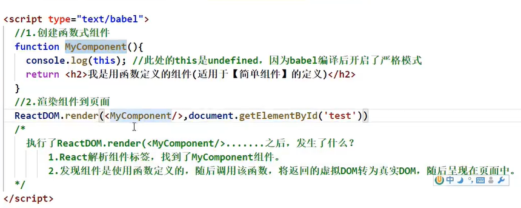

# React

## JSX

语法规则：

> 1、定义虚拟DOM的时候不要写引号
>
> 2、标签中混入JS**表达式**时要用{}，注意不是JS语句
>
> 3、样式类名指定要用className
>
> 4、内联样式要用style={{key:value}}的形式去写
>
> 5、虚拟DOM只能有一个根标签
>
> 6、标签必须闭合
>
> 7、标签首字母：若首字母小写，则转成html中同名元素，无则报错；若首字母大写，则react会去渲染对应的组件

虚拟DOM需要有一个key，用于diff算法更新DOM

> ## 小插曲：JS类的基本知识
>
> * 类中的构造器不是必须写的，要对实例进行一些初始化的操作，如添加指定属性时才写
> * 如果A继承了B，且A中写了构造器，那么A中的构造器必须要调用super(...)
> * 类中所定义的方法，都是放在类的原型对象上，供实例去使用

## 组件

