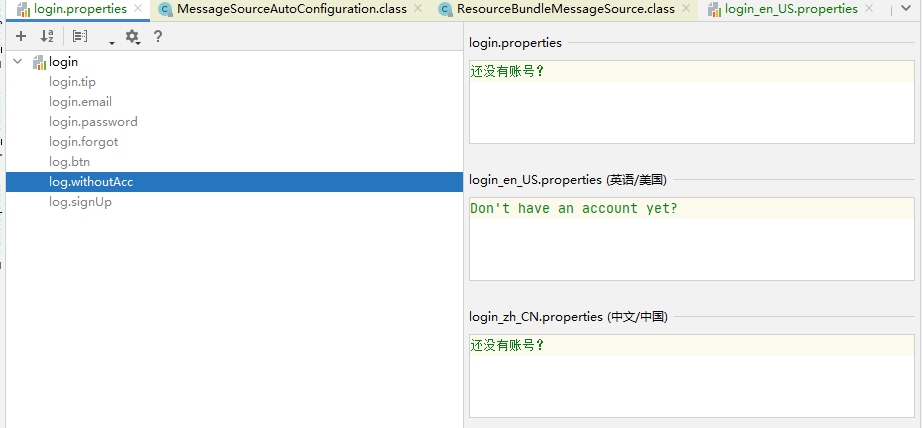
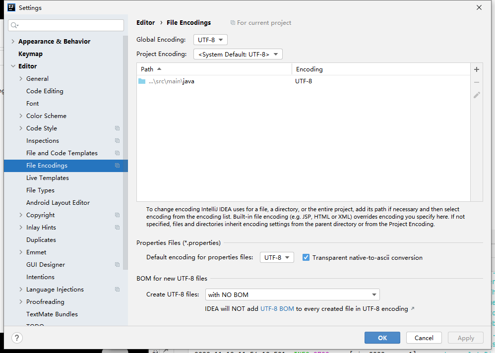
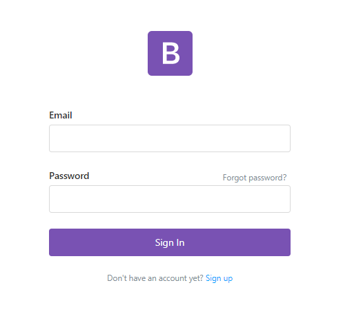
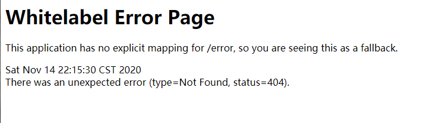
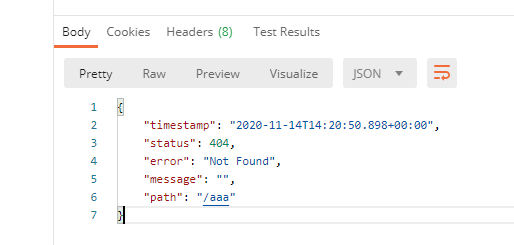

# SpringBoot（1.5.x）

简化Spring应用开发的一个框架，整个Spring技术栈的一个大集合，J2EE开发的一站式解决方案

## 微服务

一个应用应该是一组小型服务，可以通过http进行互通

每一个功能元素最终都是一个可独立替换和独立升级的软件单元

## HelloWorld

导包配环境之后：

### 编写一个主程序

```java
/**
 * @SpringBootApplication 标注一个主程序类，说明这是一个Spring boot应用
 */
@SpringBootApplication
public class HelloWorld {
    public static void main(String[] args) {
        SpringApplication.run(HelloWorld.class, args);
    }
}
```

### 编写相关Controller、Service

```java
@Controller
public class HelloWorldController {

    @ResponseBody
    @RequestMapping("/hello")
    public String hello(){
        return "Hello World!";
    }
}
```

### 运行主程序

### 简化部署

```xml
<!--pom里面加入这个插件，可以将应用打包成一个可执行的jar包-->
<build>
    <plugins>
        <plugin>
            <groupId>org.springframework.boot</groupId>
            <artifactId>spring-boot-maven-plugin</artifactId>
        </plugin>
    </plugins>
</build>
```

打成jar包后，直接使用java -jar命令进行执行

### 解释

#### pom.xml

```xml
<parent>
    <groupId>org.springframework.boot</groupId>
    <artifactId>spring-boot-starter-parent</artifactId>
    <version>1.5.9.RELEASE</version>
</parent>
<!--父项目是
<parent>
    <groupId>org.springframework.boot</groupId>
    <artifactId>spring-boot-dependencies</artifactId>
    <version>1.5.9.RELEASE</version>
    <relativePath>../../spring-boot-dependencies</relativePath>
</parent>
作为Spring Boot的版本仲裁中心-->


<!--spring-boot-starter:spirng-boot场景启动器-->
<dependency>
    <groupId>org.springframework.boot</groupId>
    <artifactId>spring-boot-starter-web</artifactId>
</dependency>
```

#### 主程序类

```java
@SpringBootApplication
public class HelloWorld {
    public static void main(String[] args) {
        SpringApplication.run(HelloWorld.class, args);
    }
}
```

@SpringBootApplication：Spring Boot应用标注在某个类上说明这个类是SpringBoot的主配置类，SpringBoot就应该运行这个类的main方法来启动SpringBoot应用

@SpringBootApplication是一个组合注解：

```java
@Target({ElementType.TYPE})
@Retention(RetentionPolicy.RUNTIME)
@Documented
@Inherited
@SpringBootConfiguration 
@EnableAutoConfiguration //自动配置功能
@ComponentScan(
    excludeFilters = {@Filter(
    type = FilterType.CUSTOM,
    classes = {TypeExcludeFilter.class}
), @Filter(
    type = FilterType.CUSTOM,
    classes = {AutoConfigurationExcludeFilter.class}
)}
)
public @interface SpringBootApplication {
```

##### @SpringBootConfiguration 

标注在某个类上表示是Spring Boot的配置类(@Configuration)，配置类也是容器中的一个组件(@Component)

##### @EnableAutoConfiguration

自动配置功能

```java
@AutoConfigurationPackage
@Import({EnableAutoConfigurationImportSelector.class})
public @interface EnableAutoConfiguration {
```

###### @AutoConfigurationPackage

自动配置包

```
@Import({Registrar.class})
```

@Import是Spring底层注解，它给容器导入一个组件，导入的组件由Registrar.class确定

**将主配置类（@AutoConfigurationPackage标注的类）所在包及下面所有子包**里面所有组件扫描到Spring容器

> EnableAutoConfigurationImportSelector：将所有需要导入的组件以全类名的方式返回，这会给容器中导入非常多的自动配置类，即给容器中导入这个场景需要的所有组件，免去了手动配置的工作。
>
> > SpringFactoriesLoader.loadFactoryNames(this.getSpringFactoriesLoaderFactoryClass(), this.getBeanClassLoader());
> >
> > Spring boot 在启动时从类路径下的META-INF/spring.factories中获取EnableAutoConfiguration指定的值，将这些值作为自动配置类导入到容器中
> >
> > J2EE整体整合解决方案和自动配置都在spring-boot-autoconfigure-1.5.9.RELEASE.jar里面

## Spring Initializer快速创建项目

勾选需要的项目支持，pom文件就会相应添加好库，

@ResponseBody、@Controller可以合并写为@RestController

### resources文件夹中的目录结构

* static：保存所有静态资源（js、css、img）

* template：保存所有的模板页面（SpringBoot默认jar包使用嵌入式的tomcat，默认不支持JSP页面，但可以使用模板引擎freemarker、thymeleaf）

* application.properties：SpringBoot应用的配置文件

## Spring Boot配置

### 配置文件

全局配置文件，配置文件名是固定的

* application.properties
* application.yml

yml是YAML语言的文件，以数据为中心，比json和xml更适合做配置文件

### YAML

#### 基本语法

**key:(space)value**（***<u>==Space is required！==</u>***它以空格的缩进来控制层级关系）

属性和值大小写敏感

#### 值的写法

##### 字面量（数字、字符、布尔）

k: v（字符串默认不用加上引号）

​		双引号：会转义字符串里面的特殊字符，比如\n转移为换行

​		单引号：不会转义字符串里面的特殊字符，是什么样就输出什么样

##### 对象、Map

k: v（在下一行来写对象的属性和值的关系，要注意缩进！）

对象里面还是k: v的模式

```yml
friends:

	lastName: xx

	age: xx

# 行内写法
friends: {lastName: xx,age: xx}
```

##### 数组（List、Set）

用- 值来表示数组中的一个元素

```yaml
pets: 
	- cat
	- dog
	- pig

# 行内写法
pets: [cat,dog,pig]
```

### Properties

中文乱码问题：settings 》 file encoding 》 properties files（改成utf-8，方框勾上）

装载数据的时候会优先使用properties里面的参数，若无，则用yml里面的补上

### 配置文件注入

#### @ConfigurationProperties、  @Value

|                    | @ConfigurationProperties                                     | @Value                 |
| :----------------- | ------------------------------------------------------------ | ---------------------- |
| 功能               | 批量注入属性                                                 | 单个注入               |
| 松散绑定           | 支持（驼峰命名：配置文件中可以写xxx-xxx，命名为xxxXxx）      | 不支持                 |
| SpEL               | 不支持                                                       | 支持（值可以直接计算） |
| JSR303数据校验     | 支持(类上加@Validated，里面可以加@Email之类的，验证格式是否对的) | 不支持                 |
| 复杂类型封装（类） | 支持                                                         | 不支持                 |

如果说只是在某个业务逻辑中需要获取一下配置文件中的某项值，使用@Value

如果说专门有一个javaBean来和配置文件进行映射，就直接使用@ConfigurationProperties  

#### @PropertySource、  @ImportResource

**@PropertySource**读取指定路径下的properties文件，可以多个（@PropertySource(value = {"classpath:person.properties"})）

**@ImportResource**导入Spring配置文件，让配置文件里面的内容有效

> * Spring Boot里面没有Spring配置文件，自己编写的文件不能被自动识别，若想要生效，用@ImportResource标注在一个配置类上（@ImportResource(locations = {"classpath:beans.xml"})）

> * Spring Boot推荐给容器中添加组件的方式：推荐使用全注解方式

```java
/**
 * 指明为配置类
 * 在配置文件中使用<bean><bean/>来添加组件，对应地，在此处用@Bean来表示
 */
@Configuration
public class MyConfig {

    @Bean
    public HelloService helloService(){
        System.out.println("@Bean给容器中添加组件啦~");
        return new HelloService();
    }
}
```

### 配置文件占位符

#### 随机数

```
${random.uuid}
${random.int}
${random.int(10)}
${random.int[2024,2000]}
...
```

#### 占位符获取之前的值

```properties
person.dog.name=${person.hello:hello}'s dog 
# 表示若获取不到person.hello就把hello当做默认值，否则没有的话输出是person.hello
```

没有的话用冒号后面的值

### Profile

* #### 多profile文件

  主配置文件的文件名可以使application-{profile}.properties/yml

  默认使用application.properties的配置

* #### yml支持多文档块方式

  三个横杠（---）回车后分隔开了一个文档块

  若有需要，可以在第一个文档块中指定要激活的文档块

  ```yaml
  spring:
    profiles:
      active: dev
  ```

  其他文档块的命名为

  ```yaml
  spring:
    profiles: dev
  ```

* #### 激活制定profile

  * 在配置文件中制定spring.profiles.active=dev

  * 命令行：

    添加Run/Debug配置的程序运行参数（Program arguments）--spring-profiles-active=dev

    也可以在打包之后用命令行启动并添加参数==java -jar xxx.jar --spring.profiles.active=dev==

  * 虚拟机参数（VM options）-Dspring.profiles.active=dev

### 配置文件加载位置

springboot启动会扫描以下位置的application.properties或者application.yml文件作为Spring Boot的默认配置文件（以下为优先级从高到低，高优先级会覆盖低优先级的相同配置，形成**互补配置**）

* 项目路径/config/application.properties
* 项目路径/application.properties
* 类路径/config/application.properties
* 类路径/application.properties

可以通过spring.config.location来改变默认的配置文件位置（项目打包以后，可以使用命令行参数的形式启动项目的时候来指定配置文件的新位置，指定配置文件会和默认加载的配置文件一起作用）**（运维使用）**


配置修改项目的访问路径（在配置文件中加）：server.context-path=/xxx

#### 外部配置加载顺序（按照优先级）（常用，不全）

* 命令行参数 java -jar xxx.jar --server.port=8082（这样的话，启动的端口号为8082）

**由jar包外向jar包内的顺序**

* 带profile的配置文件
  * jar包外部的application-{profile}.properties或application.yml（有spring.profile）
  * jar包内部的application-{profile}.properties或application.yml（有spring.profile）

* 不带profile的配置文件
  * jar包外部的application.properties或application.yml
  * jar包内部的application.properties或application.yml

* @Configuration注解类上面的@PropertySource
* 通过SpringApplication.setDefaultProperties指定的默认属性

其他详见官方文档！！！

### 自动配置原理

#### ==[自动配置原理](https://www.bilibili.com/video/BV1Et411Y7tQ?p=18)==（再看一遍！！！）

[官方文档（涉及的配置）](https://docs.spring.io/spring-boot/docs/current/reference/html/appendix-application-properties.html#server-properties)

* SpringBoot启动时加载主配置类，开启了自动配置功能==@EnableAutoConfiguration==

* @EnableAutoConfiguration：

  * 使用AutoConfigurationImportSelector给容器中导入一些组件

    可以查看selectImports（getAutoConfigurationEntry）的代码看看导入了什么

    ```java
    List<String> configurations = this.getCandidateConfigurations(annotationMetadata, attributes);//获取候选的配置
    ```

    ```java
    SpringFactoriesLoader.loadFactoryNames();
    //扫描所有jar包类路径下面的 META-INF/spring.factories
    //把扫描到的文件内容包装成properties对象
    //从properties中获取到EnableAutoConfiguration.class类名对应的值，然后添加在容器中
    ```

* 每一个自动配置类进行自动配置功能

  * e.g.

    ```java
    @Configuration(proxyBeanMethods = false)
    //表征这是一个配置类
    
    @EnableConfigurationProperties({ServerProperties.class})
    //启用ConfigurationProperties功能，将配置文件中对应的值和ServerProperties绑定起来，并加入到ioc容器中
    
    @ConditionalOnWebApplication(type = Type.SERVLET)
    //Spring底层注解@Conditional，根据不同的条件，若满足指定的条件，整个配置类里面的配置就会生效（目前是判断是否为Web应用）
    
    @ConditionalOnClass({CharacterEncodingFilter.class})
    //判断当前项目有没有这个类，CharacterEncodingFilter：Spring MVC中进行乱码解决的过滤器
    
    @ConditionalOnProperty(prefix = "server.servlet.encoding",value = {"enabled"},matchIfMissing = true)
    //判断配置文件中是否存在某个配置server.servlet.encoding，“matchIfMissing = true”表示若不存在则也认为判断是成立的
    //即使配置文件中不配置server.servlet.encoding=true，也是默认生效的
    
    public class HttpEncodingAutoConfiguration {
        
        //他已经和SpringBoot配置文件映射了
        private final Encoding properties;
        
        //只有一个有参构造器的情况下，参数的值就会从容器中获取
        public HttpEncodingAutoConfiguration(ServerProperties properties) {
            this.properties = properties.getServlet().getEncoding();
        }
    
        
        
        //判断通过后生成一个bean，但bean中的某些值由properties确定
        @Bean
        @ConditionalOnMissingBean
        public CharacterEncodingFilter characterEncodingFilter() {
            CharacterEncodingFilter filter = new OrderedCharacterEncodingFilter();
            filter.setEncoding(this.properties.getCharset().name());
            filter.setForceRequestEncoding(
            	this.properties.shouldForce(org.springframework.boot.web.servlet.server.Encoding.Type.REQUEST));
            filter.setForceResponseEncoding(
                this.properties.shouldForce(org.springframework.boot.web.servlet.server.Encoding.Type.RESPONSE));
            return filter;
        }
    }
    ```

    根据当前不同的条件判断，决定这个类是否生效

    一旦配置类生效，这个配置类就会给容器中添加各种组件，这些组件是从对应的properties中获取的，这些类里面的每一个属性都是和配置文件绑定的

    所有配置文件中能配置的属性都是在xxxProperties类中封装着，配置文件能配置什么就可以参照某个功能对应的这个属性类

    ```java
    @ConfigurationProperties(
        prefix = "server",
        ignoreUnknownFields = true
    )
    //从配置文件中获取指定的值和bean的属性进行绑定
    
    public class ServerProperties {}
    ```

精髓：

* SpringBoot启动会加载大量的自动配置类
* 我们看需要的功能有没有SpringBoot默认写好的自动配置类
* 有的话再来看这个自动配置类中到底配置了哪些组件（组件有，就不需要自己配置了）
* 组件没有的话要自己配置，给容器中自动配置类添加组件的时候，会从properties中获取某些属性，我们就可以在配置文件中指定这些属性的值

xxxAutoConfiguration：自动配置类，会给容器中添加组件

xxxProperties：封装配置文件中相关属性

#### 细节

##### @Conditional派生注解

必须是@Conditional指定的条件成立，才给容器中添加组件，配置里面配的内容才会有效

与之对应的有好多：ConditionalOnWebApplication、ConditionalOnClass、......

（自动配置类的生效是有条件的：我们可以通过启用配置文件中的debug=true来让控制台打印配置报告，就可以很方便的知道那些自动配置类生效）

## 日志

| 日志门面（日志的抽象层）                                     | 日志实现             |
| ------------------------------------------------------------ | -------------------- |
| ~~JCL（Jakarta Commons Logging）~~ SLF4j（Simple Logging Facade for Java） ~~jboss-logging~~ | log4j log4j2 logback |

左边选一个门面，右边选一个实现

SpringBoot的选择：==SLF4j和Logback==，而底层的Spring框架默认选择的是JCL

### SLF4j

开发的时候调用日志抽象层里面的方法，给系统里面导入slf4j的jar和logback的jar

```java
import org.slf4j.Logger;
import org.slf4j.LoggerFactory;

public class HelloWorld {
  public static void main(String[] args) {
    Logger logger = LoggerFactory.getLogger(HelloWorld.class);
    logger.info("Hello World");
  }
}
```

每一个日志的实现框架都有自己的配置文件，使用slf4j以后，配置文件还是做成日志实现框架自己本身的配置文件

有别的框架，要用slf4j统一：

* 将系统中其他日志框架先排除出去
* 用中间包来替换原有的日志框架
* 导入slf4j的其他框架实现

**总结：**

SpringBoot底层也是slf4j+logback的方式进行日志记录的

SpringBoot也把其他的日志都换成了slf4j

中间替换包：虽然包是log4j，但是里面已经是以SLF4J实例化了

若要引用其他的框架，一定要把这个框架的默认日志依赖移除掉！pom里面<exclusions>...</exclusions>

### 日志使用

yml文件里添加配置

com开始及以后锁定作用范围

```yml
logging:
  level:
    com:
      example:
        demo:
          debug
```

```java
//注意导的是这俩~
import org.slf4j.Logger;
import org.slf4j.LoggerFactory;


//日志记录器
Logger logger = LoggerFactory.getLogger(getClass());

@Test
void contextLoads() {
    //日志级别由低到高：trace<debug<info<warn<error
    //这样可以调整输出的日志级别来只打印某个级别及更高级别的日志

    //SpringBoot默认输出Info以及以后的日志,可以在全局配置里面定义级别
    logger.trace("这是TRACE日志...");
    logger.debug("这是DEBUG日志...");
    logger.info("这是INFO日志...");
    logger.warn("这是WARN日志...");
    logger.error("这是ERROR日志...");
}
```

其他配置项：

```yml
#不指定路径表示在当前项目下生成日志文件
logging:
  file:
    name: springboot.log
    
  #这俩会冲突
  
  #表示在当前项目路径下的spring/log文件夹内创建日志，默认为spring.log
  file:
    path: ./spring/log
    
  #自定义输出日志的格式
  pattern:
    console: xxx #在控制台输出的日志的格式
    file: xxx #在指定文件输出的日志的格式
```

### 指定配置

给类路径下放上自己的每个日志框架配置文件即可，SpringBoot就不使用默认的配置了

不同框架该放的配置文件名不一样的哦~

logback.xml：直接就被日志框架识别了

logback**-spring**.xml：日志框架就不直接加载日志的配置项，由SpringBoot解析日志配置，可以使用SpringBoot的高级Profile功能

```xml
<appender>
	<layout>
        <springProfile name="staging">
            <!--可以指定某段配置只在某个环境下生效-->
        </springProfile>
    </layout>
</appender>
```

### 切换日志框架

（不建议这么做）

可以按照slf4j日志适配图进行切换slf4j+log4j

exclude掉logback和log4j的替代包

导入log4j包

指定log4j的配置文件log4j.properties


如果想用log4j2，直接排除掉spring-boot-starter-logging并依赖上spring-boot=starter-log4j2即可

## Web开发

### SpringBoot对静态资源的映射规则

```java
public void addResourceHandlers(ResourceHandlerRegistry registry) {
    if (!this.resourceProperties.isAddMappings()) {
        logger.debug("Default resource handling disabled");
    } else {
        Duration cachePeriod = this.resourceProperties.getCache().getPeriod();
        CacheControl cacheControl = this.resourceProperties.getCache().getCachecontrol().toHttpCacheControl();
        if (!registry.hasMappingForPattern("/webjars/**")) {
            this.customizeResourceHandlerRegistration(registry.addResourceHandler(new String[]{"/webjars/**"}).addResourceLocations(new String[]{"classpath:/META-INF/resources/webjars/"}).setCachePeriod(this.getSeconds(cachePeriod)).setCacheControl(cacheControl));
        }

        String staticPathPattern = this.mvcProperties.getStaticPathPattern();
        if (!registry.hasMappingForPattern(staticPathPattern)) {
            this.customizeResourceHandlerRegistration(registry.addResourceHandler(new String[]{staticPathPattern}).addResourceLocations(WebMvcAutoConfiguration.getResourceLocations(this.resourceProperties.getStaticLocations())).setCachePeriod(this.getSeconds(cachePeriod)).setCacheControl(cacheControl));
        }

    }
}
```

* 所有/webjars/**下的所有请求都去classpath:/META-INF/resources/webjars/里面找资源

  webjars以jar包的方式引入静态资源

```java
@ConfigurationProperties(
    prefix = "spring.resources",
    ignoreUnknownFields = false
)
public class ResourceProperties {}
//可以设置和静态资源有关的参数，缓存时间等
```

* /**可以访问当前项目的任何资源（静态资源的文件夹）

```
"classpath:/META-INF/resources/"
"classpath:/resources/"
"classpath:/static/"
"classpath:/public/"
```

​	比如localhost:8080/abc找不到就会去这几个文件夹下面找

* 欢迎页：静态资源文件夹下面的所有index.html页面被"/**"映射（有优先级）

### 模板引擎

jsp、velocity、freemarker、thymeleaf

Spring Boot推荐使用**Thymeleaf**

#### 引入thymeleaf

```xml
<dependency>
    <groupId>org.springframework.boot</groupId>
    <artifactId>spring-boot-starter-thymeleaf</artifactId>
</dependency>
<!--https://docs.spring.io/spring-boot/docs/2.3.5.RELEASE/reference/htmlsingle/#using-boot-starter-->

举例修改springboot默认配置的包
<properties>
	<thymeleaf.version>3.0.11.RELEASE</thymeleaf.version>
    <thymeleaf-extras-data-attribute.version>2.0.1</thymeleaf-extras-data-attribute.version>
    <thymeleaf-extras-java8time.version>3.0.4.RELEASE</thymeleaf-extras-java8time.version>
    <thymeleaf-extras-springsecurity.version>3.0.4.RELEASE</thymeleaf-extras-springsecurity.version>
</properties>
注意版本号的适配
```

#### 使用thymeleaf

```java
@ConfigurationProperties(
    prefix = "spring.thymeleaf"
)
public class ThymeleafProperties {
    private static final Charset DEFAULT_ENCODING;
    public static final String DEFAULT_PREFIX = "classpath:/templates/";
    public static final String DEFAULT_SUFFIX = ".html";
    private boolean checkTemplate = true;
    private boolean checkTemplateLocation = true;
    private String prefix = "classpath:/templates/";
    private String suffix = ".html";
    //只要把html页面放在templates下面，thymeleaf就会渲染了
    private String mode = "HTML";
```

demo：

```java
@Controller
public class HelloController {
    @ResponseBody
    @RequestMapping("/hello")
    public String hello(){
        return "Hello~";
    }
    
    @RequestMapping("/success")
    public String success(){
        return "success";
    }
}

/*然后在templates下面建立一个success.html就可以通过访问接口跳转到这个页面了
注意不要使用RestController和ResponseBody，否则显示的是原来的返回信息*/
```

[语法详见官方文档](https://www.thymeleaf.org/)

==被thymeleaf渲染的template路径下的页面想要获取spring默认配置的访问静态资源路径下的资源，不用加static/xxx，直接xxx就行了==

### Spring MVC自动配置

boot对Spring MVC的默认配置：

- Inclusion of `ContentNegotiatingViewResolver` and `BeanNameViewResolver` beans.

  * 自动配置ViewResolver（视图解析器：根据方法的返回值得到视图对象View，视图对象决定如何渲染）

  * ContentNegotiatingViewResolver：组合所有的视图解析器

    可以自己定制视图解析器：给容器中添加一个视图解析器，自动就会组合进来

- Support for serving static resources, including support for WebJars (covered [later in this document](https://docs.spring.io/spring-boot/docs/2.3.5.RELEASE/reference/htmlsingle/#boot-features-spring-mvc-static-content))).

  * 静态资源文件夹路径、webjars

- Automatic registration of `Converter`, `GenericConverter`, and `Formatter` beans.

  * 自动注册了`Converter`, `GenericConverter`, `Formatter`。
  * Converter：转化器，页面传来的数据类型需要转换
  * Formatter：格式化器，页面带来的数据（比如时间）需要按一定格式编排

- Support for `HttpMessageConverters` (covered [later in this document](https://docs.spring.io/spring-boot/docs/2.3.5.RELEASE/reference/htmlsingle/#boot-features-spring-mvc-message-converters)).

  * HttpMessageConverters：SpringMVC用来转换Http请求和响应的：User--json
  * HttpMessageConverters是从容器确定的，获取所有的HttpMessageConverter，自己给容器添加HttpMessageConverter，只需要将自己的组件注册在容器中（@Bean、@Component。。。）

- Automatic registration of `MessageCodesResolver` (covered [later in this document](https://docs.spring.io/spring-boot/docs/2.3.5.RELEASE/reference/htmlsingle/#boot-features-spring-message-codes)).

  * 定义错误代码生成规则

- Static `index.html` support.

  * 静态首页访问

- Custom `Favicon` support (covered [later in this document](https://docs.spring.io/spring-boot/docs/2.3.5.RELEASE/reference/htmlsingle/#boot-features-spring-mvc-favicon)).

  * favicon.ico

- Automatic use of a `ConfigurableWebBindingInitializer` bean (covered [later in this document](https://docs.spring.io/spring-boot/docs/2.3.5.RELEASE/reference/htmlsingle/#boot-features-spring-mvc-web-binding-initializer)).

  * 可以配置一个ConfigurableWebBindingInitializer来替换默认的（添加到容器中）
  * 初始化WebDataBinder，请求数据转化为Bean

If you want to keep those Spring Boot MVC customizations and make more [MVC customizations](https://docs.spring.io/spring/docs/5.2.10.RELEASE/spring-framework-reference/web.html#mvc) (interceptors, formatters, view controllers, and other features), you can add your own `@Configuration` class of type `WebMvcConfigurer` but **without** `@EnableWebMvc`.

If you want to provide custom instances of `RequestMappingHandlerMapping`, `RequestMappingHandlerAdapter`, or `ExceptionHandlerExceptionResolver`, and still keep the Spring Boot MVC customizations, you can declare a bean of type `WebMvcRegistrations` and use it to provide custom instances of those components.

If you want to take complete control of Spring MVC, you can add your own `@Configuration` annotated with `@EnableWebMvc`, or alternatively add your own `@Configuration`-annotated `DelegatingWebMvcConfiguration` as described in the Javadoc of `@EnableWebMvc`.

**org.springframework.boot.autoconfigure.web：web的所有自动场景**

### 扩展Spring MVC

```xml
<mvc:view-controller path="/hello" view-name="success"/>
<mvc:interceptors>
    <mvc:interceptor>
        <mvc:mapping path="/hello"/>
        <bean></bean>
    </mvc:interceptor>
</mvc:interceptors>
```

**编写一个配置类（@Configuration），得是实现WebMvcConfigurer，不能标注@EnableWebMvc**

```java
@Configuration
public class MyMvcConfig implements WebMvcConfigurer {
    @Override
    public void addViewControllers(ViewControllerRegistry registry) {
        registry.addViewController("/go").setViewName("success");
    }
}
//表示访问go路径就会渲染出success对应的资源文件success.html
```

既保留了自动配置，又可以扩展自己的配置

原理：

* WebMvcAutoCongifuration是SpringMVC的自动配置类

* 在做其他自动配置导入的时候，@Import(**EnableWebMvcConfiguration**.class)

* ```java
  public static class EnableWebMvcConfiguration extends DelegatingWebMvcConfiguration implements ResourceLoaderAware {}
  ```

  ```java
  public class DelegatingWebMvcConfiguration extends WebMvcConfigurationSupport {
      private final WebMvcConfigurerComposite configurers = new WebMvcConfigurerComposite();
  
      public DelegatingWebMvcConfiguration() {
      }
  
      @Autowired(
          required = false
      )
      public void setConfigurers(List<WebMvcConfigurer> configurers) {
          if (!CollectionUtils.isEmpty(configurers)) {
              this.configurers.addWebMvcConfigurers(configurers);
          }
  
      }
      ......
  ```

  容器中的所有WebMvcConfiguration都会一起作用

* 自己写的配置类也会被调用

### 全面接管SpringMVC

SpringBoot对SpringMVC的自动配置都不需要了，所有都是自己配置

需要在配置类中添加注解@EnableWebMvc，比如加上这个注解，所有的SpringMVC自动配置都会失效

原理：

* @EnableWebMvc的核心

  ```
  @Import({DelegatingWebMvcConfiguration.class})
  ```

* ```
  public class DelegatingWebMvcConfiguration extends WebMvcConfigurationSupport {
  ```

* ```java
  //WebMvcAutoConfiguration
  @Configuration(
      proxyBeanMethods = false
  )
  @ConditionalOnWebApplication(
      type = Type.SERVLET
  )
  @ConditionalOnClass({Servlet.class, DispatcherServlet.class, WebMvcConfigurer.class})
  @ConditionalOnMissingBean({WebMvcConfigurationSupport.class})
  @AutoConfigureOrder(-2147483638)
  @AutoConfigureAfter({DispatcherServletAutoConfiguration.class, TaskExecutionAutoConfiguration.class, ValidationAutoConfiguration.class})
  public class WebMvcAutoConfiguration {
  ```

  **@ConditionalOnMissingBean({WebMvcConfigurationSupport.class})**

  注意只有没有**WebMvcConfigurationSupport**的时候才会进行后续的自动配置，而注解@EnableWebMvc加了一个WebMvcConfigurationSupport，导致自动配置失效啦

* 导入的WebMvcConfigurationSupport只是SpringMVC的最基本功能

### 修改SpringBoot的默认配置

spring boot的配置模式：

* springboot在自动配置组件的时候，先看容器中有没有用户自己配置的（@Bean、。。。）有的话就用用户的，没有就自动配置，如果组件有多个（ViewResolver），则用户配置和自己配置的并存
* springboot中会有非常多的xxxCongifuration帮助进行扩展配置

### RESTfulCRUD

#### 默认访问首页

* 一种办法是在控制类里编写RequestMapping，映射到thymeleaf能识别的template下面

* 一种办法是在Configuration类里面注册一个Bean：WebMvcConfigurer

  ```java
  @Bean
  public WebMvcConfigurer webMvcConfigurer(){
      return new WebMvcConfigurer(){
          @Override
          public void addViewControllers(ViewControllerRegistry registry) {
              registry.addViewController("/").setViewName("welcome");
              registry.addViewController("/index.html").setViewName("welcome");
          }
      };
  }
  ```

#### 国际化

* Spring的管理方法：

  使用国际化配置文件

  使用ResourceBundleMessageSource

* SpringBoot的做法

  **1、编写国际化配置文件，抽取页面需要显示的国际化消息**

  
  
  更改编码方式，防止中文乱码

  

  **2、SpringBoot自动配置好了管理国际化资源文件的组件**

```java
public class MessageSourceAutoConfiguration {
    private static final Resource[] NO_RESOURCES = new Resource[0];

    public MessageSourceAutoConfiguration() {
    }

    @Bean
    @ConfigurationProperties(
        prefix = "spring.messages"
    )
    public MessageSourceProperties messageSourceProperties() {
        return new MessageSourceProperties();
    }

    @Bean
    public MessageSource messageSource(MessageSourceProperties properties) {
        ResourceBundleMessageSource messageSource = new ResourceBundleMessageSource();
        if (StringUtils.hasText(properties.getBasename())) {
            //设置国际化资源文件的基础名（去掉语言国家代码）
            //配置文件可以直接放在类路径下叫做messages.properties
            messageSource.setBasenames(StringUtils.commaDelimitedListToStringArray(StringUtils.trimAllWhitespace(properties.getBasename())));
        }

        if (properties.getEncoding() != null) {
            messageSource.setDefaultEncoding(properties.getEncoding().name());
        }

        messageSource.setFallbackToSystemLocale(properties.isFallbackToSystemLocale());
        Duration cacheDuration = properties.getCacheDuration();
        if (cacheDuration != null) {
            messageSource.setCacheMillis(cacheDuration.toMillis());
        }

        messageSource.setAlwaysUseMessageFormat(properties.isAlwaysUseMessageFormat());
        messageSource.setUseCodeAsDefaultMessage(properties.isUseCodeAsDefaultMessage());
        return messageSource;
    }
```

​		**3、页面获取国际化的值**

```html
<div class="form-group">
    <label for="user_login" th:text="#{login.email}"></label>
    <input type="text" name="log" id="user_login" class="form-control" value="" size="20">
</div>
<div class="form-group">
    <label for="user_pass" th:text="#{login.password}"></label>
    <a class="form-sublink" href="https://themes.getbootstrap.com/my-account/lost-password/" th:text="#{login.forgot}"></a>
    <input type="password" name="pwd" id="user_pass" class="form-control" value="" size="20">
</div>

<p class="login-remember"><label><input name="rememberme" type="checkbox" id="rememberme"
                                        value="forever"> Remember Me</label></p>
<div class="form-group">
    <input type="submit" name="wp-submit" id="wp-submit" class="btn btn-brand btn-block mb-4"
           th:value="#{log.btn}">
    <input type="hidden" name="redirect_to" value="https://themes.getbootstrap.com/my-account/">
</div>
```

效果：

* 默认语言为中文


* 浏览器改成英文（美国）之后

  

原理：

国际化Locale（区域信息对象）；LocaleResolver（获取区域信息对象）

```java
@Bean
@ConditionalOnMissingBean
@ConditionalOnProperty(
    prefix = "spring.mvc",
    name = {"locale"}
)
public LocaleResolver localeResolver() {
    if (this.mvcProperties.getLocaleResolver() == org.springframework.boot.autoconfigure.web.servlet.WebMvcProperties.LocaleResolver.FIXED) {
        return new FixedLocaleResolver(this.mvcProperties.getLocale());
    } else {
        AcceptHeaderLocaleResolver localeResolver = new AcceptHeaderLocaleResolver();
        localeResolver.setDefaultLocale(this.mvcProperties.getLocale());
        return localeResolver;
    }
}
//默认根据请求头带来的区域信息获取Locale
public Locale resolveLocale(HttpServletRequest request) {
```

自己定义一个LocaleResolver

```java
public class MyLocaleResolver implements LocaleResolver {
    @Override
    public Locale resolveLocale(HttpServletRequest httpServletRequest) {
        String l = httpServletRequest.getParameter("l");
        Locale locale = Locale.getDefault();
        //根据传来的语言信息做出变化（用户按下href跳转到链接）
        if (!StringUtils.isEmpty(l)) {
            String[] split = l.split("_");
            locale = new Locale(split[0], split[1]);
        }
        return locale;
    }

    @Override
    public void setLocale(HttpServletRequest httpServletRequest, HttpServletResponse httpServletResponse, Locale locale) {

    }
}
```

#### 登录拦截器

* 开发期间模板引擎页面修改后要实时生效，需要禁用模板引擎的缓存，页面修改完成以后 ctrl+F9重新编译**spring.thymeleaf.cache=false**

* 登录错误消息的显示

  > ```html
  > <p style="color: #e2401c" th:text="${msg}" th:if="${not #strings.isEmpty(msg)}"></p>
  > ```

* 拦截器登录检查

  * 若只是在Controller里面判断

    ```java
    @PostMapping(value = "/user/login")
    public String login(@RequestParam("username") String username,
                        @RequestParam("password") String password,
                        Map<String, Object> map,
                        HttpSession session){
        if(StringUtils.isEmpty(username) || !password.equals("123456")){
            map.put("msg","login failed~");
            return "welcome";
        }
        else{
            session.setAttribute("loginUser",username);
            return "success";
        }
    }
    ```

    会存在一些问题：静态资源的映射（因为渲染的页面是在/user/login下面的，而且只是这样的话，对于成功登录的页面可以不凭登录信息随便访问）

  于是乎，要对需要登录才能获取的资源进行拦截(返回的success改成重定位"redirect:/go")

  ```java
  public class LoginHandlerInterceptor implements HandlerInterceptor {
      @Override
      public boolean preHandle(HttpServletRequest request, HttpServletResponse response, Object handler) throws Exception {
          //查看会话中有没有loginUser
          Object user = request.getSession().getAttribute("loginUser");
          if(user==null){
              /**
               * 未登录，拦截
               */
              request.setAttribute("msg","请先登录");
              //没有loginUser就会携带信息跳转到登录页面
              request.getRequestDispatcher("/index").forward(request,response);
              return false;
          }
          else{
              //有loginUser的话放行
              return true;
          }
  
      }
  
      @Override
      public void postHandle(HttpServletRequest request, HttpServletResponse response, Object handler, ModelAndView modelAndView) throws Exception {
  
      }
  
      @Override
      public void afterCompletion(HttpServletRequest request, HttpServletResponse response, Object handler, Exception ex) throws Exception {
  
      }
  }
  ```

  注意在配置类的WebMvcConfigurer中注册拦截器

  ```java
  @Configuration
  public class MyMvcConfig implements WebMvcConfigurer {
      @Override
      public void addViewControllers(ViewControllerRegistry registry) {
          registry.addViewController("/go").setViewName("success");
      }
  
      @Bean
      public WebMvcConfigurer webMvcConfigurer(){
          return new WebMvcConfigurer(){
              @Override
              public void addViewControllers(ViewControllerRegistry registry) {
                  registry.addViewController("/").setViewName("welcome");
                  registry.addViewController("/index").setViewName("welcome");
                  registry.addViewController("/index.html").setViewName("welcome");
              }
              //注册拦截器
              @Override
              public void addInterceptors(InterceptorRegistry registry) {
                  registry.addInterceptor(new LoginHandlerInterceptor()).addPathPatterns("/**")
                          .excludePathPatterns("/","/index","/index.html","/user/login");
                  ///user/login是表单提交的动作，不要拦截
              }
          };
      }
  
      @Bean
      public LocaleResolver localeResolver(){
          return new MyLocaleResolver();
      }
  }
  ```

#### RESTfulCRUD

对比：

|      | 普通CRUD（以URI来区分操作） |   RESTful CRUD   |
| :--: | :-------------------------: | :--------------: |
|  增  |         addEmp?xxx          |    emp--POST     |
|  删  |      deleteEmp?id=xxx       | emp/{id}--DELETE |
|  改  |  updateEmp?id=xxx&xxx=xxx   |  emp/{id}--PUT   |
|  查  |           getEmp            |     emp--GET     |

##### thymeleaf公共页面元素抽取

给需要抽取的元素加上th:fragment="topbar"

在需要放置的地方添上th:insert="~{dashboard :: topbar}"，**注意这里是波浪线**dashboard是抽取的元素所在的模板html名

th:insert在里面插公共部分

th:replace整个替换公共部分

th:include替换公共部分的里面部分

##### demo

```html
<div class="wrapper">
    <div class="sidebar">
        <div th:replace="commons/bar :: #sidebar(activeUri='emps')"></div>
    </div>
    <div class="main-panel">

        <div th:replace="commons/bar :: topbar"></div>
        <div class="modal modal-search fade" id="searchModal" tabindex="-1" role="dialog" aria-labelledby="searchModal"
             aria-hidden="true">
            <div class="modal-dialog" role="document">
                <div class="modal-content">
                    <div class="modal-header">
                        <input type="text" class="form-control" id="inlineFormInputGroup" placeholder="SEARCH">
                        <button type="button" class="close" data-dismiss="modal" aria-label="Close">
                            <i class="tim-icons icon-simple-remove"></i>
                        </button>
                    </div>
                </div>
            </div>
        </div>
        <!-- End Navbar -->
        <div class="content">
            <div class="row">
                <div class="col-md-12">
                    <div class="card ">
                        <!--控制器里面拦截的是emp的post类请求-->
                        <form th:action="@{/emp}" th:method="post">
                            <div class="form-group">
                                <label for="exampleFormControlInput1">名字</label>
                                <!--注意name要和javabean里面的变量名称是一致的-->
                                <input name="name" class="form-control" id="exampleFormControlInput1" placeholder="小明">
                            </div>
                            <fieldset class="form-group">
                                <div class="row">
                                    <legend class="col-form-label col-sm-2 pt-0">性别</legend>
                                    <div class="col-sm-10">
                                        <div class="form-check">
                                            <input class="form-check-input" type="radio" name="gender" id="gridRadios1"
                                                   value="1" checked>
                                            <label class="form-check-label" for="gridRadios1">
                                                男
                                            </label>
                                        </div>
                                        <div class="form-check">
                                            <input class="form-check-input" type="radio" name="gender" id="gridRadios2"
                                                   value="0">
                                            <label class="form-check-label" for="gridRadios2">
                                                女
                                            </label>
                                        </div>
                                    </div>
                                </div>
                            </fieldset>
                            <div class="form-group">
                                <label for="exampleFormControlSelect1">部门</label>
                                <select class="form-control" id="exampleFormControlSelect1" name="dept.id">
                                    <option th:value="${dept.id}" th:each="dept:${depts}"
                                            th:text="${dept.name}"></option>
                                </select>
                            </div>
                            <div class="col-auto">
                                <button type="submit" class="btn btn-primary mb-2">提交</button>
                            </div>
                        </form>
                    </div>
                </div>
            </div>
        </div>
    </div>
</div>
```

对应的Controller:

```java
//添加员工
//Spring MVC自动将请求参数和入参对象的属性进行绑定：要求请求参数的名字和JAVABEAN入参的对象的属性名是一样的
@PostMapping("/emp")
public String addEmp(Emp emp){
    empDao.save(emp);
    //redirect表示重定向到一个地址
    //forward表示转发到一个地址
    return "redirect:/emps";
    //emps已经被之前的方法映射过了，表示定向到list页面去查看所有的列表结果
}
```

提交的数据格式不对的话。。。：（日期）

> 日期格式化：SpringMVC将页面提交的值需要转换为指定的类型
>
> 默认日期是按照“/”的方式来的

**详见项目springboot-web内容**

### 错误处理机制

#### SpringBoot默认的错误处理机制



返回了一个错误页面

其他客户端的访问错误结果



原理：

