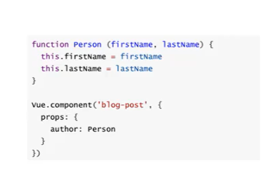

# 2020/11

### 计算属性

结果作为data里面的东西（property）

### 绑定内联样式

使用了**驼峰命名法**：fontSize

```html
<div v-bind:style="{ color: activeColor, fontSize: fontSize + 'px' }"></div>
```

多种样式用于一个对象

```html
<div v-bind:style="[baseStyles, overridingStyles]"></div>
```

### 条件渲染

* 把一个 `<template>` 元素当做不可见的包裹元素，并在上面使用 `v-if`。最终的渲染结果将不包含 `<template>` 元素。

```html
<template v-if="ok">
  <h1>Title</h1>
  <p>Paragraph 1</p>
  <p>Paragraph 2</p>
</template>
```

* Vue 为你提供了一种方式来表达“这两个元素是完全独立的，不要复用它们”。只需添加一个具有唯一值的 `key` attribute 即可：

```html
<template v-if="loginType === 'username'">
  <label>Username</label>
  <input placeholder="Enter your username" key="username-input">
</template>
<template v-else>
  <label>Email</label>
  <input placeholder="Enter your email address" key="email-input">
</template>
```

* 带有 `v-show` 的元素始终会被渲染并保留在 DOM 中。`v-show` 只是简单地切换元素的 CSS property `display`。

  注意，`v-show` 不支持 `<template>` 元素，也不支持 `v-else`。

* `v-if` 是“真正”的条件渲染，因为它会确保在切换过程中条件块内的事件监听器和子组件适当地被销毁和重建。

  `v-if` 也是**惰性的**：如果在初始渲染时条件为假，则什么也不做——直到条件第一次变为真时，才会开始渲染条件块。

  相比之下，`v-show` 就简单得多——不管初始条件是什么，元素总是会被渲染，并且只是简单地基于 CSS 进行切换。

  一般来说，`v-if` 有更高的切换开销，而 `v-show` 有更高的初始渲染开销。因此，如果需要非常频繁地切换，则使用 `v-show` 较好；如果在运行时条件很少改变，则使用 `v-if` 较好。

* **不推荐**同时使用 `v-if` 和 `v-for`

### 列表渲染

在 `v-for` 块中，我们可以访问所有父作用域的 property。`v-for` 还支持一个可选的第二个参数，即当前项的索引。

```html
<ul id="example-2">
  <li v-for="(item, index) in items">
    {{ parentMessage }} - {{ index }} - {{ item.message }}
  </li>
</ul>
```

```javascript
var example2 = new Vue({
  el: '#example-2',
  data: {
    parentMessage: 'Parent',
    items: [
      { message: 'Foo' },
      { message: 'Bar' }
    ]
  }
})
```

当 Vue 正在更新使用 `v-for` 渲染的元素列表时，它默认使用“就地更新”的策略。如果数据项的顺序被改变，Vue 将不会移动 DOM 元素来匹配数据项的顺序，而是就地更新每个元素，并且确保它们在每个索引位置正确渲染。这个类似 Vue 1.x 的 `track-by="$index"`。

这个默认的模式是高效的，但是**只适用于不依赖子组件状态或临时 DOM 状态 (例如：表单输入值) 的列表渲染输出**。

为了给 Vue 一个提示，以便它能跟踪每个节点的身份，从而重用和重新排序现有元素，你需要为每项提供一个唯一 `key` attribute：

```html
<div v-for="item in items" v-bind:key="item.id">
  <!-- 内容 -->
</div>
```

**不要使用对象或数组之类的非基本类型值作为 `v-for` 的 `key`。请用字符串或数值类型的值。**

#### 数组更新

这些被包裹过的方法包括：

- `push()`
- `pop()`
- `shift()`
- `unshift()`
- `splice()`
- `sort()`
- `reverse()`

你可能认为这将导致 Vue 丢弃现有 DOM 并重新渲染整个列表。幸运的是，事实并非如此。Vue 为了使得 DOM 元素得到最大范围的重用而实现了一些智能的启发式方法，所以用一个含有相同元素的数组去替换原来的数组是非常高效的操作。

#### 显示过滤/排序后的结果

```html
<li v-for="n in evenNumbers">{{ n }}</li>

<ul v-for="set in sets">
  <li v-for="n in even(set)">{{ n }}</li>
</ul>
```

```js
data: {
  numbers: [ 1, 2, 3, 4, 5 ]
},
computed: {
  evenNumbers: function () {
    return this.numbers.filter(function (number) {
      return number % 2 === 0
    })
  }
}


data: {
  sets: [[ 1, 2, 3, 4, 5 ], [6, 7, 8, 9, 10]]
},
methods: {
  even: function (numbers) {
    return numbers.filter(function (number) {
      return number % 2 === 0
    })
  }
}
```

类似于 `v-if`，你也可以利用带有 `v-for` 的 `<template>` 来循环渲染一段包含多个元素的内容。比如：

```html
<ul>
  <template v-for="item in items">
    <li>{{ item.msg }}</li>
    <li class="divider" role="presentation"></li>
  </template>
</ul>
```

#### v-for 与 v-if 一同使用

注意我们**不**推荐在同一元素上使用 `v-if` 和 `v-for`。

```html
<li v-for="todo in todos" v-if="!todo.isComplete">
  {{ todo }}
</li>


<ul v-if="todos.length">
  <li v-for="todo in todos">
    {{ todo }}
  </li>
</ul>
<p v-else>No todos left!</p>
```

### 事件处理

。。。

# 2020/12

## 1 概念和基础操作

* MVVM（model view viewmodel）

* 创建Vue实例传入的options

  > el：可以使string或者HTMLElement
  >
  > data：Object或者Function（组件当中data必须是一个函数）
  >
  > methods：{key（String）:Function}

* 生命周期：


* v-once：不会根据数据的改变而改变
* v-html：会把属性值解析成DOM

* v-text：会覆盖text

* v-pre：原封不动地显示，不要解析

* v-cloak：未解析完成时有这个属性，解析成功会消除这个属性

* v-bind：绑定属性（语法糖写法——:src="xxx"）

  > 动态绑定class：
  >
  > :class="{xxx:true, xxx:false, xxx:true}"，json放在data里面  //对象写法
  >
  > :class="[xxx,xxx]"  //数组写法
  >
  > 绑定style类似，注意属性值时字符串（加引号）！否则会到data里面找，key可以用驼峰，也可以横杠分割

## 2 基础操作（计算属性、ES6语法、v-model）

* getter&setter：计算属性一般没有set方法，即一般为只读属性，简写即删去**get标识**，直接作为方法的形式，使用的时候即调用get方法，故**不加括号**

  set方法是在调用xxx=xxx的时候生效，赋值即为往set方法传参

* 方法methods没有缓存，重复使用会多次调用，计算属性有缓存，只有发生变化的时候才会重新调用

* ES5 var的坑：

  只有函数是有作用域的，块级必须借助function才有作用于

  > ```js
  > var btns=document.getElementsByTagName('button');
  > for(var i=0;i<btn.length;i++){
  >     btns[i].addEventListener('click',function(){
  >         console.log('第'+i+'个按钮被点击');
  >     })
  > }
  > //执行后于绑定监听，导致所有按钮点击后都打印btn.length
  > //这回因为var没有块级作用域
  > //一个解决办法：闭包
  > for(var i=0;i<btn.length;i++){
  >     (function(i){
  >         //闭包后里面的i相当于新的变量
  >         btns[i].addEventListener('click',function(){
  >         	console.log('第'+i+'个按钮被点击');
  >     	})
  >     })(i)
  > }//可行，这是因为函数是有作用域的，但是看起来很别扭
  > ```

  而ES6中，let是有块级作用域的

* const：在开发中**优先使用const**、只有需要改变某一标识符的时候才能使用let

  使用const必须初始化，常量所指向的对象不能修改，但是可以修改对象的属性

* ES6对象的增强写法：

  > ```js
  > const name='mary'
  > const age=18
  > 
  > const obj={
  >     name,
  >     age,
  >     //函数
  >     run(){
  >         ...
  >     },
  >     ...
  > }
  > //这样obj就是{
  > //	name: 'mary',
  > //	age: 18
  > //}了
  > ```

* v-on参数传递问题：

  > 事件调用的方法没有参数，@click='xxx()'小括号加不加无所谓
  >
  > 在事件定义的时候，调用时小括号里面没有参数，但是方法本身需要参数，形参为undefined
  >
  > 在事件定义的时候，调用时没有小括号，但是方法本身需要参数，此时会将Event对象作为第一个参数传入函数，其他的参数为undefined
  >
  > 自己要传入event的时候传**$event**即可，否则不加dollar符会解析成data里的变量或者计算属性

* 修饰符

  > @click.stop='xxx'
  >
  > @click.prevent='xxx'阻止默认的动作发生，只发生指定的动作
  >
  > @click.once='xxx'只发生一次
  >
  > @keyup.enter='xxx'
  >
  > ......

* Vue在DOM渲染的时候，出于性能考虑，会尽可能复用已经存在的元素，而不是重新创建新的元素

  加key作为标识就可以不复用

* v-if和v-show的区别：v-if不满足条件的话不会存在这个DOM元素，而v-show不满足条件只是display设为none

  > 开发中的选择：切换频率很高的时候可以选择v-show
  >
  > 一般会大量使用v-if

* v-for获取对象：

  > 在遍历过程中如果只是获取值，则可以 item in items
  >
  > 想要获取key、value，需要（value，key） in items
  >
  > 还想获取index，需要（value，key，index）

* v-for绑定key

  key要保证唯一性

  > key的作用主要是为了高效更新虚拟DOM

  

* 并不是所有改变数组数据的方法都能做到响应式：

  > 能做到响应式的方法，（方法可能有可变参数（可传多个值））
  >
  > push
  >
  > pop
  >
  > shift：左移
  >
  > unshift：右移，头一个添加元素
  >
  > **splice**：**（删除、插入、替换）**参数：[start（开始删的index）、删除几个元素（插入为0）、（可变参数：添加的数据）]
  >
  > sort
  >
  > reverse

  不要用下标修改的方式（xxx[0]=xxx），这样Vue不会响应的显示

  但如果是一个对象数组，修改对象属性是会响应的

  可以用Vue.set(要修改的对象、索引值、修改后的对象)

* 面向函数编程

  filter/map/reduce

  ```js
  const nums = [10,20,30,40,50,60,70,80,90,100]
  let newNums = nums.filter(function(n){
      return n<50;
  });
  
  let newNums2 = newNums.map(function(n){
      return n*2;
  });
  
  
  let total = newNums2.reduce(function(preVal, n){
      return preVal + n
  },0);
  
  //初始值设为0，首次遍历preVal为0，首次遍历结束，存值为0+ele[0]。。。
  //函数式编程
  //可以进行链式编程~
  let newNums = nums.filter(function(n){
      return n<50;
  }).map(function(n){
      return n*2;
  }).reduce(function(preVal, n){
      return preVal + n
  },0);
  
  //箭头函数
  let newNums = nums.filter(n => n<100).map(n => n*2).reduce((pre,n) => pre+n, 0);
  ```

* input的其他类型与v-model绑定

  ```js
  const app = new Vue({
      el: '#app',
      data: {
          message: "hello",
          sex: "male",
          choices: [],
          originChoices:['one','two','three'],
          fruit:"grape",
          originFruits:['apple','banana','orange','grape','melon'],
          age:0
      }
  })
  ```

  > ```html
  > <!--同一个name可以防止同时点击，因为表单提交根据了name的唯一性-->
  > <label for="male"><input type="radio" id="male" name="sex" value="male" v-model="sex">male</label>
  > <label for="female"><input type="radio" id="female" name="sex" value="female" v-model="sex">female</label>
  > 
  > <!--另外，单选的v-model绑定同一个变量也会使得互斥，此时就没有必要指定name了-->
  > <label for="male"><input type="radio" id="male" value="male" v-model="sex">male</label>
  > <label for="female"><input type="radio" id="female" value="female" v-model="sex">female</label>
  > <h2>您选择的性别是 {{sex}}</h2>
  > ```
  >
  > ```html
  > <label v-for="item in originChoices" :for="item">
  >     <input type="checkbox" :value="item" :id="item" v-model="choices">{{item}}
  > </label>
  > <!--多选框对应数组-->
  > <div>your choices:{{choices}}</div>
  > 
  > <select name="abc" v-model="fruit">
  >     <option v-for="item in originFruits" :value="item">{{item}}</option>
  > </select>
  > <div>your fruit: {{fruit}}</div>
  > ```

* v-model修饰符

  lazy、trim、number。。。

  ```html
  <!--1 修饰符-->
  <!--加lazy不会边输入边显示，当失去焦点时或回车会更新-->
  <input type="text" v-model.lazy="message">{{message}}
  <!--默认情况下v-model赋值是string类型，需要自己限制类型就在v-model后面加.number（比如这个就是限制为数字类型）-->
  <input type="number" v-model.number="age">{{age}}
  <!--v-model.trim可以删除前后多余的空格-->
  ```

## 3 组件化

* 组件使用的步骤：创建组件构造器、注册组件、使用组件

  ```js
      //创建组件构造器
      //子组件
      const cpnConstructor2 = Vue.extend({
          template:`
              <div>
                  <h2>Title2</h2>
                  <p>Container2</p>
              </div>
          `
      })
      //父组件
      const cpnConstructor = Vue.extend({
          template: `
              <div>
                  <h2>Title</h2>
                  <p>Container</p>
                  <my-cpn2></my-cpn2>
              </div>
          `,
          //在此处注册其他组件就可以在模板中用了
          //但作用域只限定于此
          components:{
              'my-cpn2': cpnConstructor2
          }
      })
  
      //注册组件（全局组件，可以在多个vue实例下使用）
      // Vue.component('my-cpn', cpnConstructor)
  
      //也可以看作为顶层组件（root）
      const app = new Vue({
          el: "#app",
          data: {
              message: "hello"
          },
          //局部组件
          components: {
              'my-cpn': cpnConstructor
          }
      })
  ```

  

* 父子组件的==**错误**==使用：以子标签的形式在Vue实例中使用

  当子组件注册到父组件的components时，Vue会编译好父组件的模块，该模块的内容已经决定了父组件要渲染的html，因此子组件只能在父组件中被识别。

* 注册组件语法糖

  下面的样例很乱。。。。

  ```html
  <div id="app">
      <!--只有在vue作用域下才行-->
      <cpn1></cpn1>
  </div>
  <script src="../js/vue.js"></script>
  <script>
      //父组件语法糖（全局）
      Vue.component('cpn1', {
          template: `
            <div>
            <h2>Title</h2>
            <p>Container</p>
            <cpn2></cpn2>
            </div>
          `,
          //局部组件语法糖
          //子组件
          components: {
              'cpn2': {
                  template: `
                      <div>
                          <h2>Title2</h2>
                          <p>Container2</p>
                      </div>
                  `
              }
          }
      })
  
      //注册组件（全局组件，可以在多个vue实例下使用）
      // Vue.component('my-cpn', cpnConstructor)
  
      //也可以看作为顶层组件（root）
      const app = new Vue({
          el: "#app",
          data: {
              message: "hello"
          }
      })
  </script>
  ```

  分离：

  ```html
  <template id="cpn">
      <div>
          <h2>Title</h2>
          <p>Container</p>
          <h2>{{message}}</h2>
      </div>
  </template>
  <script>
      Vue.component('cpn', {
          template: "#cpn",
          data(){
              return {
                  message: "abc"
              }
          }
      })
  
      const app = new Vue({
          el: "#app",
          data: {
              message: "hello"
          }
      })
  </script>
  ```

  组件是一个单独模块的封装，组件不能访问Vue实例的数据，但组件可以有一个访问其内部数据的地方，组件对象也有一个data属性，data属性必须是一个函数（返回一个对象，对象内部保存数据），也可以有methods等属性

* 小知识点：

  ```js
  function getobj(){
      return {
          a:'1',
          b:'2'
      }
  }
  
  obj1=getobj();
  obj2=getobj();
  obj3=getobj();
  
  obj1、2、3所指向的不是同一个对象
  
  同理，组件中要求data为一个函数，就是为了防止返回给每个组件的data是不同的对象，因为组件是要拿来复用的
  ```


## 4 父子组件通信

* 父组件通过props向子组件传递数据

  子组件通过事件向父组件发送消息

  ```html
  <body>
      <div id="app">
          <cpn :cmessage="message" :cmovies="movies"></cpn>
      </div>
  
  </body>
  
  <template id="cpn">
      <div>
          <h2>{{cmessage}}</h2>
          <ul>
              <li v-for="item in cmovies">{{item}}</li>
          </ul>
      </div>
  </template>
  ```

  ```js
  const cpn = {
          template: '#cpn',
          data() {
              return {}
          },
          props: {
              //也可以用array的写法["cmessage","cmovies"]，但是这样可以限定类型
              //这种写法可以提供默认值
              cmessage: {
                  type: String,
                  default: "Halo!",
                  //表示必须要传这个值，否则报错
                  required: true
              },
              //类型是对象或者数组时，默认值必须是一个函数default(){return xxx}
              cmovies: Array
          }
      }
      const app = new Vue({
          el: "#app",
          data: {
              message: "hello",
              movies: ["la la land","antman","a dog's purpose"]
          },
          components: {
              //增强写法，等价于cpn：cpn
              cpn
          }
      })
  ```

  

  props里面可以有的类型


​			还可以自定义类型

​			